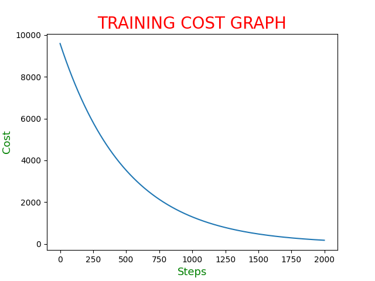
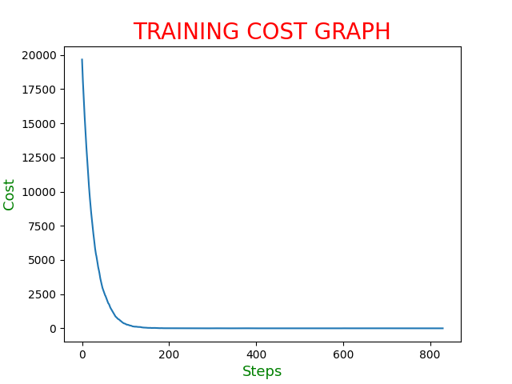
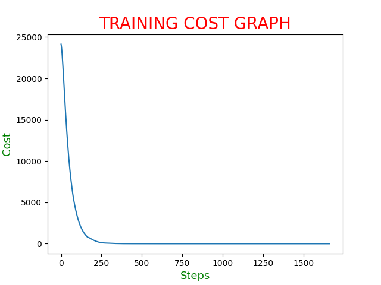
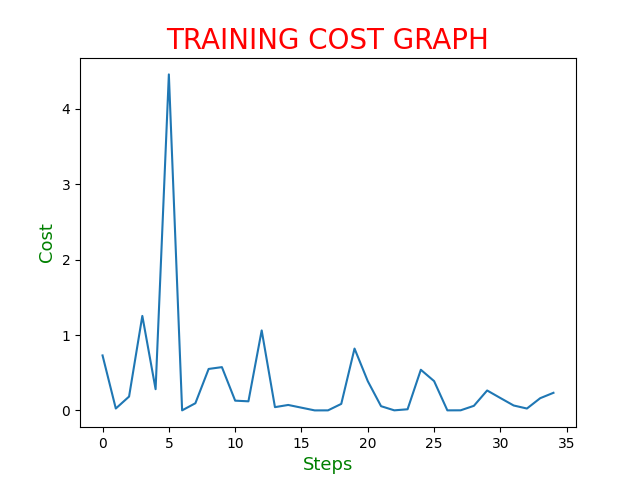
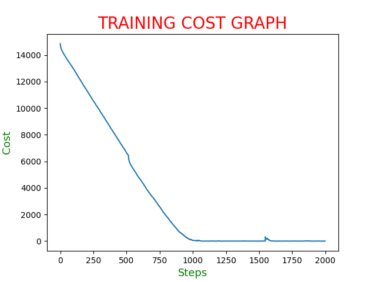
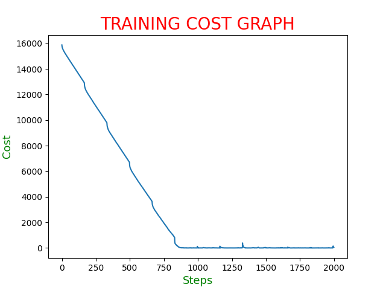
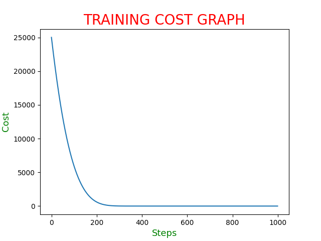
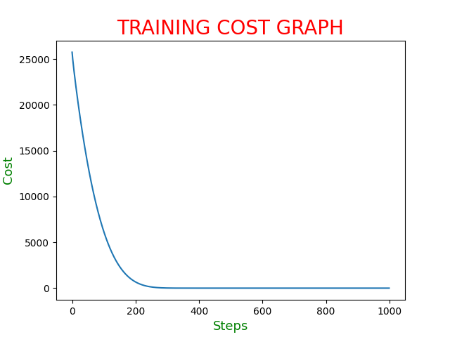

# Optimizers' Implementation Code

## Table of contents
- ### [File Structure](#filestruct)
- ### [Dataset](#dataset)
- ### [Usage](#usage)
    * [Batch Gradient Descent](###Batch-Gradient-Descent)
    * [Stochastic Gradient Descent](###Stochastic-Gradient-Descent)
    * [Mini Batch Gradient Descent](###Mini-Batch-Gradient-Descent)
    * [Momentum](###Momentum)
    * [Nesterov Accelerated Gradient](###Nesterov-Accelerated-Gradient)
    * [Adagrad](###Adagrad)
    * [Adadelta](###Adadelta)
    * [RMS Prop](###RMSProp)
    * [Adam](###Adam)
    * [Adamax](###Adamax)
    * [Nadam](###Nadam)
- ### [Extras](##Extras)
- ### [References](##References)
    

## File Structure
1. `optimizer_training.py`  
    
    Contains the code for training the optimizers
2. `optimizer_functions.py` 

    Contains the implementations of all the optimizers used.

3. `utitlites.py` 

    Contains extra functions like cost calculation, gradient calculation and graph plotting.

## Dataset
The Dataset used here is California Housing Dataset loaded from sklearn package.

We use the standardized House age column of the dataset to predict the Median house price.

## Usage
Follow the steps to use the code.
* Clone the Repository.
* Install the Requirements mentioned in the requirements.txt

    ` pip install -r requirements.txt `

* Now you can run the Program with the optimizer of your choice.

    Example - 

    `python3 optimizer_training.py --optimizer Batch`

This command with train and test on the dataset using Batch Gradient optimizer. Here is a list of optimizers implemented.

The following Algorithms are implemented here - 
1.  ### Batch Gradient Descent
    Vanilla gradient descent, aka batch gradient descent, computes the gradient of the cost function w.r.t.
    to the parameters θ for the entire training dataset

    Here's the cost graph obtained using The code implemented - 

    

    Command -

    `python3 optimizer_training.py --optimizer Batch`

2.  ### Stochastic Gradient Descent
    Stochastic gradient descent (SGD) in contrast performs a parameter update for each training example

    Here's the cost graph obtained using the code implemented - 

    

    Command -

    `python3 optimizer_training.py --optimizer Stochastic`

3.  ### Mini Batch Gradient Descent
    Mini-batch gradient descent finally takes the best of both worlds and performs an update for every
    mini-batch of n training examples

    Here's the cost graph obtained using the code implemented - 

    

    Command -

    `python3 optimizer_training.py --optimizer MiniBatch`

4.  ### Momentum
    Momentum [17] is a method that helps accelerate SGD in the relevant direction and dampens
    oscillations of the Gradient update. It does this by adding a fraction γ of the update vector of the
    past time step to the current update vector.

    Here's the cost graph obtained using the code implemented - 

    

    Command -

    `python3 optimizer_training.py --optimizer Momentum`

5.  ### Nesterov Accelerated Gradient
    Nesterov accelerated gradient (NAG) is a way to give our momentum term this kind of prescience.
    We know that we will use our momentum term γ vt−1 to move the parameters θ.

    Here's the cost graph obtained using the code implemented - 

    

    Command -

    `python3 optimizer_training.py --optimizer Nesterov`

6.  ### Adagrad 
    Adagrad is an algorithm for gradient-based optimization that does just this: It adapts the learning rate to the parameters, performing larger updates for infrequent and smaller updates for frequent parameters.

    Here's the cost graph obtained using the code implemented - 

    

    Command -

    `python3 optimizer_training.py --optimizer Adagrad`

7.  ### Adadelta
    Adadelta is an extension of Adagrad that seeks to reduce its aggressive, monotonically decreasing
    learning rate. Instead of accumulating all past squared gradients, Adadelta restricts the window of
    accumulated past gradients to some fixed size w.

    Here's the cost graph obtained using the code implemented - 

    

    Command -

    `python3 optimizer_training.py --optimizer Adadelta`

8.  ### RMSprop
    RMSprop as well divides the learning rate by an exponentially decaying average of squared gradients.

    Here's the cost graph obtained using the code implemented - 

    

    Command -

    `python3 optimizer_training.py --optimizer RMSprop`

9.  ### Adam
    Adaptive Moment Estimation (Adam) [10] is another method that computes adaptive learning rates
    for each parameter. In addition to storing an exponentially decaying average of past squared gradients vt like Adadelta and RMSprop, Adam also keeps an exponentially decaying average of past gradients mt, similar to momentum.

    Here's the cost graph obtained using the code implemented - 

    

    Command -

    `python3 optimizer_training.py --optimizer Adam`

10. ### Adamax
    We generalize the gradient update rule of Adam to lp norm 

    Here's the cost graph obtained using the code implemented - 

    

    Command -

    `python3 optimizer_training.py --optimizer Adamax`

11. ### Nadam
    Nadam (Nesterov-accelerated Adaptive Moment Estimation) combines Adam and NAG. In
    order to incorporate NAG into Adam, we need to modify its momentum term mt.

    Here's the cost graph obtained using the code implemented - 

    

    Command -

    `python3 optimizer_training.py --optimizer Nadam`

## Extras
*   Use the command 

    `python3 optimizer_training.py -h`

    for a list of available command line optimizer arguments.

*   If you want to change the hyperparams of any optimizer, you will find the default arguments in `optimzer_training.py` file, you can change them to your use.
* Feel free to explore the well documented code.

## References
* [Research Paper](https://arxiv.org/pdf/1609.04747.pdf)

   
